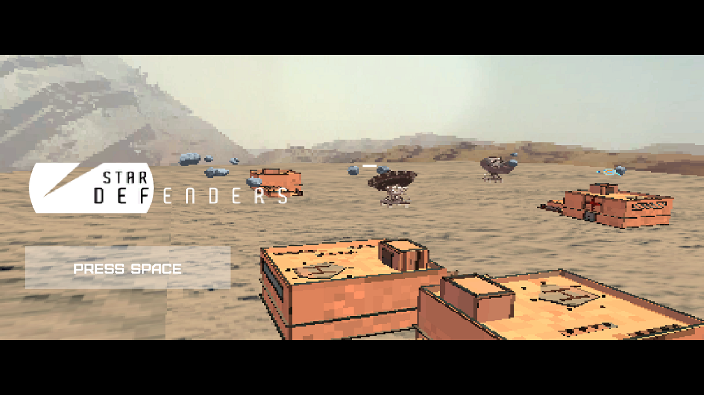
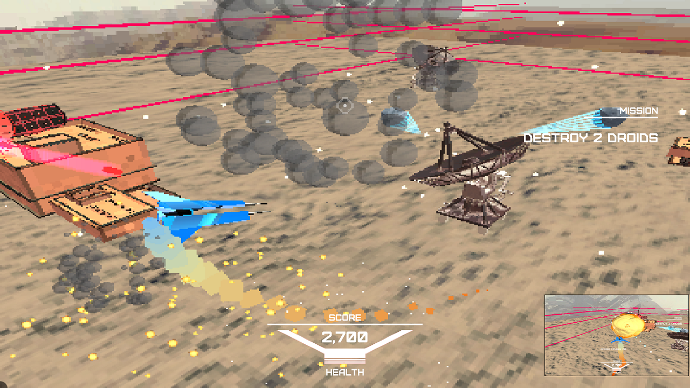
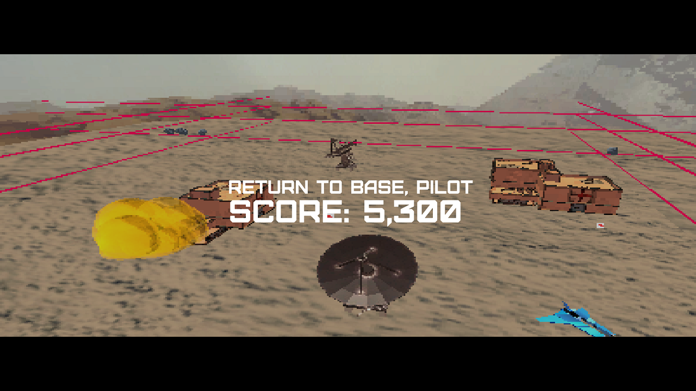
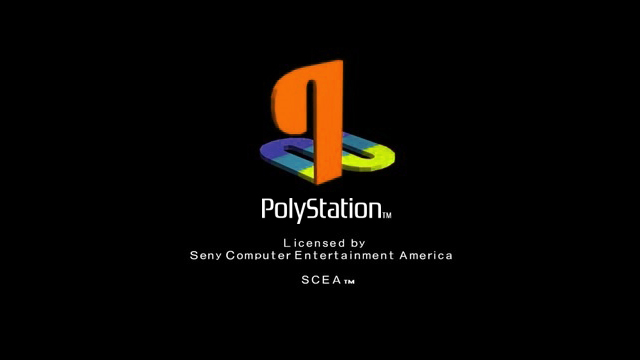
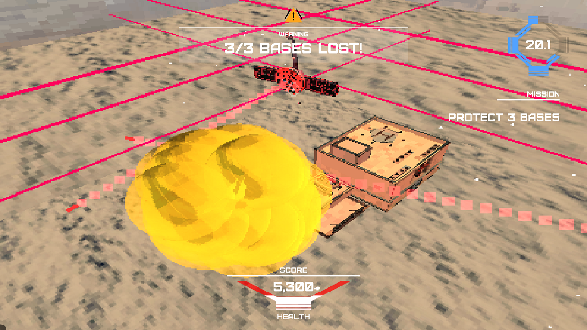

A game inspired by the Atari classic 'Asteroids', built in Unity3D/C#.  
This project is being built with Unity 5.3.4, though you can probably make it work in any Unity 5.x installation.

  

### My Original Plan
1. Replicate Asteroids gameplay as much as possible  
2. Select an appropriate theme and aesthetic to generate assets  
3. Tweak camera until satisfactory for fun action gameplay  
4. Add 2-3 extra objectives to shift focus away from 'simply shoot everything'

  

## Post-Mortem

### Extenal Assets Used
+ Destiny Soundtrack ("#43. Excerpt from the Union")  
  + I'll replace this as soon as I have the time to source a similar free track    
+ Concept art backdrop ("Star Wars: The Force Awakens")  
+ 3D models from Poly by Google (poly.google.com)  
+ SFX from freesounds.org

### Learnings
+ I realised I love the PSone aesthetic!  
+ Music and SFX make a huge difference to perceived 'fun'  
+ A LOT of work goes into building base game frameworks; plan ahead and re-use whenever possible   
  + Everyone has to solve the same problems, so find out what others do before you try designing a new system
  + Examples in this project: Music system, Weapon Controller, Projectiles, Pool Managers    

### What went well
#### Gameplay  
  + Base gameplay of Asteroids was easy to replicate    
  + Camera change was IMO necessary as it conveyed a lot more of the frantic feeling of being surrounded    
#### Code Clarity  
+ I think this codebase is on the cleaner side!    
+ Small classes; Inheritance used when required    
#### Git
+ GitHub was a great idea!    
  + Forced me to think about other people reading my commits and code changes      
  + No more 'select all and push'      
#### Visuals  
+ Really like how much this affords me in terms of iteration and 'kitbashing' time    
#### Audio  
+ Loved working SFX and music into the game, it really lends a Star Wars feel to it    
#### Animation and other Polish  
+ Spent some time on animation the final sequence     
  + I loved doing that; would consider expanding on this game with more story sequences      
+ Worked on making the UI transitions fluid    
+ Fake logo and screen at start sets the tone and expectations going in    

### Improvements to make
#### Gameplay
+ I spent too much time planning and building wall-edge teleport mechanics to mimic original Asteroids    
  + Waited too long to play-test; it actually confused players      
  + Finally, removed it in favour of a simple slow-down, small damage, and warning message      
+ Protect the Base game mode not as engaging as I expected    
  + Maybe there's only 1 Base at a time (like Rush mode in Bad Company 2)      
  + Need to drive focus towards objective in a more obvious fashion (HUD elements perhaps)      
+ Player Aim 'confidence' could be higher    
  + Have not investigated mouse look controls yet      
#### UX  
+ Integrating controls tutorial into the game as an introductory level would work better    
#### Visuals  
+ UI and HUD need to be suitably low-rez as well    
#### Audio  
+ Better sound mix and variety in explosion SFX    
#### Code Clarity  
+ I think I misused the 'abstract' functionality of the BaseObject class    
  + It felt like a hindrance more than a help      
  + I would just inherit from BaseObject or use it an Interface next time            
+ Maybe more code comments?    
  + I value code clarity over comments so this codebase should be easy to read      
    + But if it's not clear, then more comments!        

  

### TODO List
1. I had a system for high-scores halfway done before I scrapped it to meet the deadline  
2. Visuals could do with some proper art direction  
3. Mission select as there's a mission system begging to be properly utilised  
4. Ship upgrades  
5. More cutscenes and story!
